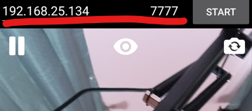

# VTube Engine
Soon to be* Open source 3D VTuber toolset created with unreal engine 5, I've made this tool with the goal of making a free and high quality option for VTuber with VRM models, VRM importing built it but is possible with a bit of modification to run all systems on any skeletal mesh.
## Features
- Camera and lighting controls
- Real time attachment system, FBX/OBJ runtime mesh import, most image formats.
- Event system with various triggerable effects.
- Granular configuration for each of a morph target/blendshape to be bound to a face tracker's output data, or a microphone's inputs audio Visemes.
- Hosts a local server to connect to twitch.tv pubsub, and irc chat, as well as providing functionality for their events.
## Usage Guide
Download a release from the releases tab or run project itself within Unreal Engine 5
VTube Engine's main functionality consists of using a mobile phone face tracking app to send face tracking data to the program.
### Step 1: Download a face tracker
|Device|Tracker
|----|----|
Android|VTE Tracker APK https://github.com/***REMOVED***/VTE-Tracker, not on play store yet.
iPhone X and newer| LiveLink Face https://apps.apple.com/us/app/live-link-face/id1495370836
iPhone X and newer| IfacialMocap https://apps.apple.com/us/app/ifacialmocap/id1489470545
### Step 2: Connect tracking to VTube Engine.

ANDROID

  
- Write down local Ip and port in VTube Engine and click the "Set" button

- Enter local IP and port into VTube Engine Android app and click start

IPHONE

Livelink Face

- Write down local IP displayed within VTube Engine DISREGARD THE PORT AND IGNORE THE SET BUTTON

  
- Enter the local IP into the Livelink Face app. DO NOT ENTER PORT.

- As of writing this, Livelink face does not support head position, so turn on head position from rotation setting in the avatar config, if you use an included config you will have to set this and save it after loading the included config!
  

IFacialMocap

- Enter iphone local ip address into Vtube Engine.

### Step 3: Load your VRM model.
## License
This project makes use of multiple third party plugins and its non derivative source and content is licensed under the MIT license.
|Plugin|Link|License|
|----|----|----|
|VTube Engine| https://github.com/***REMOVED***/VtubeEngine | MIT License
|Oculus Lipsync Unreal Integration v29|https://developer.oculus.com/documentation/unreal/audio-ovrlipsync-unreal/ |Oculus Audio SDK License 3.3|
|TwitchInteractionUE| https://github.com/zeplin455/TwitchInteractionUE |MIT License
|VRM4U| https://github.com/ruyo/VRM4U |MIT License|
|assimp| https://github.com/assimp/assimp |3-clause BSD-License|
|ruyo/assimp| https://github.com/ruyo/assimp |3-clause BSD-License|
|JsonLiveLink|https://github.com/ue4plugins/JSONLiveLink |MIT License|
|Victory Plugin|https://github.com/EverNewJoy/VictoryPlugin |MIT License|
|UDP-Unreal|https://github.com/getnamo/UDP-Unreal |MIT License

## Notes
For this project to package properly in unreal 5 you must connect your github account to Epic Games and download the source for VRM4U (https://github.com/ruyo/UnrealEngine_VRM4UPlugin) add plugins/VRM4U to this repository's plugin folder.